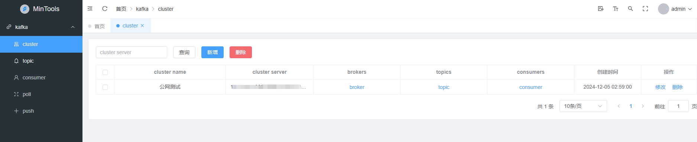
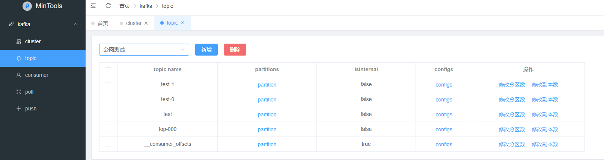
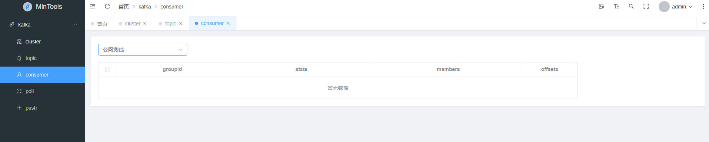
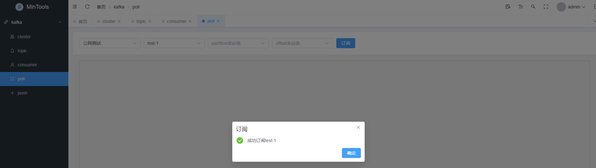
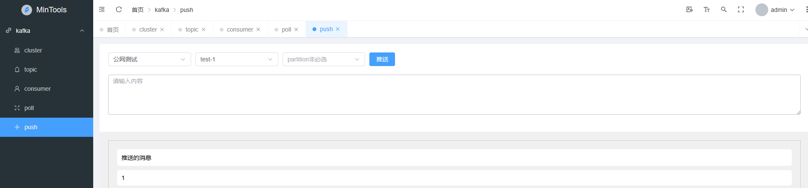

## 项目基于开源项目进行修改
 **[https://gitee.com/makunet/maku-element-admin](http://)** 

# Kafka Client Tool 前端代码

## 演示环境地址
   [演示地址](http://49.232.252.229/)

## 系统界面
 **cluster** 
 

 **topic** 

 **consumer** 

 **poll** 

 **push** 

## 后端代码
   [后端代码](https://gitee.com/xingyusix/kafka-client)

## github代码
    [后端代码](https://github.com/xy1997/kafka-client)

    [前端代码](https://github.com/xy1997/kafka-client-web)

